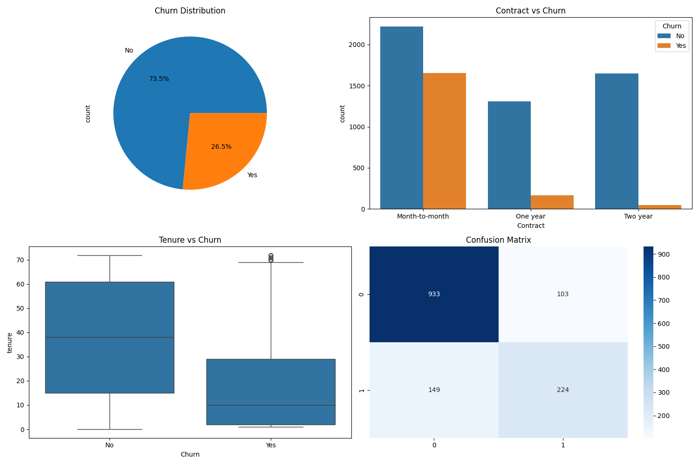
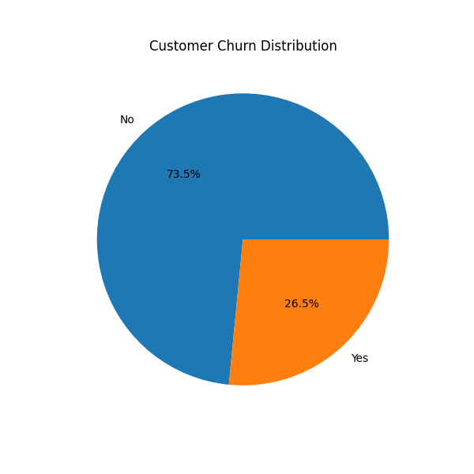
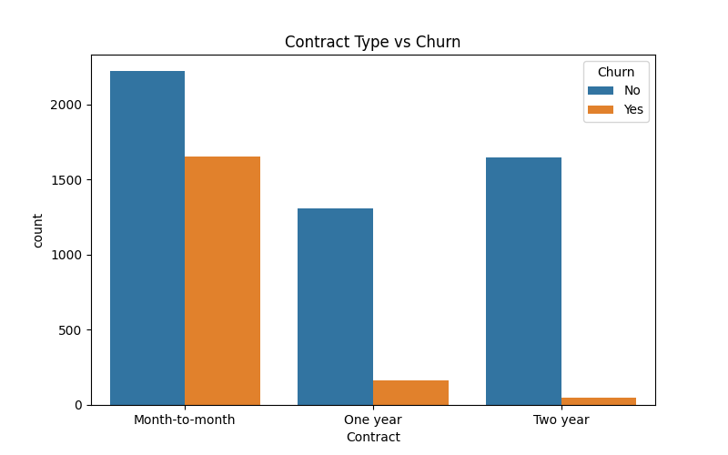
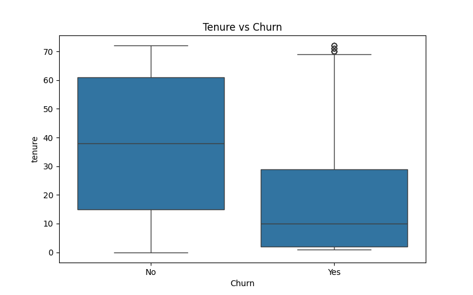
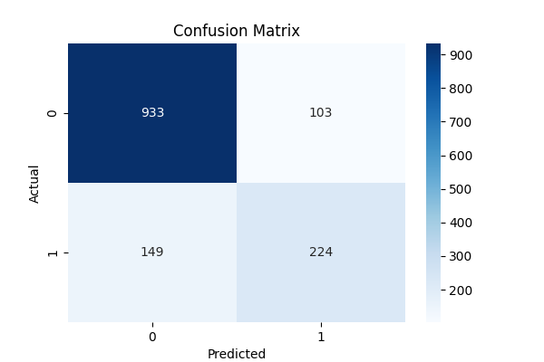

# Customer Retention & Churn Analysis

---

## Project Overview

This project focuses on analyzing customer churn behavior and predicting customer retention using machine learning techniques.

The project helps businesses:
- identify churn patterns,
- understand customer behavior,
- improve retention strategies,
- and reduce customer loss.

---

## Tools & Technologies Used

- Python
- Pandas
- NumPy
- Matplotlib
- Seaborn
- Scikit-learn
- Jupyter Notebook
- VS Code

---

## Dataset

Telco Customer Churn Dataset

---

## Project Workflow

1. Data Cleaning
2. Exploratory Data Analysis
3. Churn Analysis
4. Customer Segmentation
5. Feature Encoding
6. Machine Learning Model
7. Churn Prediction
8. Dashboard & Reporting

---

## Key Insights

- Customers with month-to-month contracts showed higher churn rates.
- Customers with shorter tenure were more likely to leave.
- Higher monthly charges increased churn probability.
- Long-term customers had better retention rates.

---

## Machine Learning Model

Model Used:
- Logistic Regression

Evaluation Metrics:
- Accuracy Score
- Confusion Matrix
- Classification Report

---

## Dashboard

---

## Visualizations

### Customer Churn Distribution

### Contract Type vs Churn

### Tenure vs Churn

### Confusion Matrix

---

## Reports

Detailed report available in:
reports/final_report.md

---

## Conclusion

This project demonstrates practical machine learning and business analytics skills for customer retention analysis and churn prediction.
